```{r, echo = FALSE, message = FALSE}
knitr::opts_chunk$set(comment = "#>", collapse = TRUE)
```

## Why use the shiny? Advantages and Disadvantages

[Shiny](http://shiny.rstudio.com/) is a powerful and open source interactive data visualization Web Framework based on the [R language](https://cran.r-project.org/). It was developed by the [RStudio](https://www.rstudio.com/) company, and the source code can be downloaded in [GitHub](https://github.com/rstudio/shiny) repo. 

The followed R command `install.packages('shiny')` can be used to install it. Several useful articles about shiny can be found in [here](http://shiny.rstudio.com/articles/)

### Advantages

- To develop a simple web application, the users just need to learn the basic R knowledge.
- The [annovarR](https://github.com/JhuangLab/annovarR) package is developed by R, and more suitable to use the shiny framework.
- Most of visulization tool for genetic variants data were also developed by R. So, it is convenient for the developers and users that not need to transfer between different programming platform.
- Community and business support
- Short period of development
- UI using [Bootstrap](https://getbootstrap.com/) style
- Public application library [shinyapps.io](http://www.shinyapps.io/) and [Shinyproxy](https://www.shinyproxy.io/)
- Background web services of [rstudio-server](https://www.rstudio.com/products/rstudio-server-pro/) and [shiny-server](https://www.rstudio.com/products/shiny-server-pro/)

### Disadvantages

- Poor support for high concurrency.
- Expensive prices of shiny-server pro and rstudio pro
- Not so flexible for professional web developer
- Less support for distributed computing

In general, it is best choices of annovarR for in-house web service for genetic variants data annotation and visulization. We hope this shiny application can improve the interactivity of annovarR, and reduce its use difficulty for unprofessional. Meanwhile, we also provides a set of functions to build the simple cloud computing app for other purpose, such as variant calling, RNA-seq data analysis, etc.

## GUI of annovarR

When you started a instance of annovarR shiny app in Rstudio or R client, it will shows the URL and port: `Listening on http://127.0.0.1:3234`. The port was random, and you can control the host and port of annovarR by parameteres `host` and `port` in `annovarR::web()` or `shiny::runApp()`.

### Home page

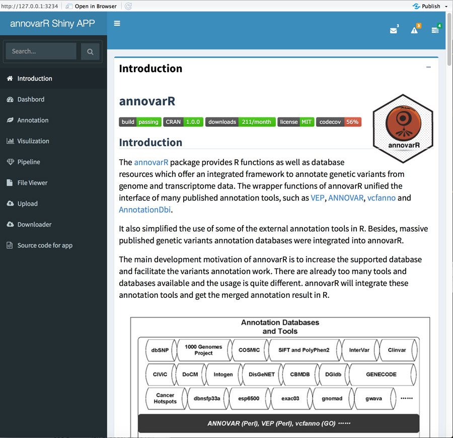

annovarR [README.md](https://github.com/JhuangLab/annovarR/blob/master/README.md) was include as the introducation page. Total nine tab item were provided:

- Introduction
- Dashbord
- Annotation
- Visulization
- Pipeline
- File Viewer
- Upload
- Downloader
- Source code for app

### Dashbord page

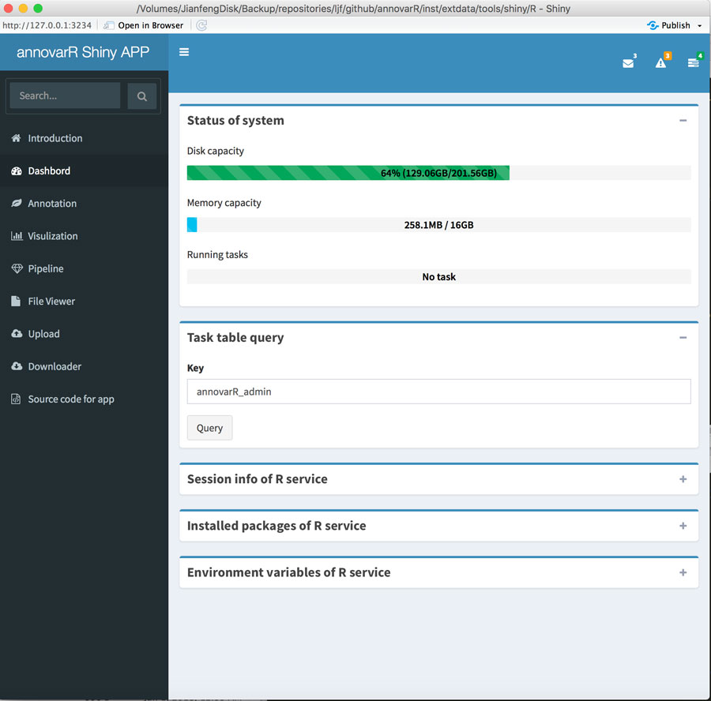

`Dashbord page` mainly shows the monitor of system, such as disk and memory, and tasks. Output of `session_info()`, `installed.packages()` and `Sys.getenv()` also were provided.

### Annotation page

`Annotation page` is the main interface for genetic variants annotation. It will submit a annotation work to the worker pool, and you can get the output figures/tables or other format files via input a post key in the `dashbord page`.

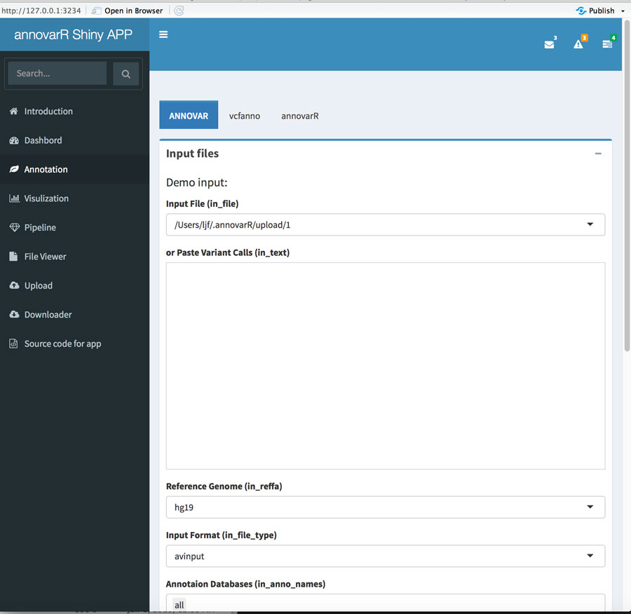

### Visulization page

`Visulization page` is the main interface for genetic variants visulization. It will generated the interactive plots or tables in the output boxes. Not like annotation tab item, all tools in the visulization will returned the real time calculation results according to the users inputs. 

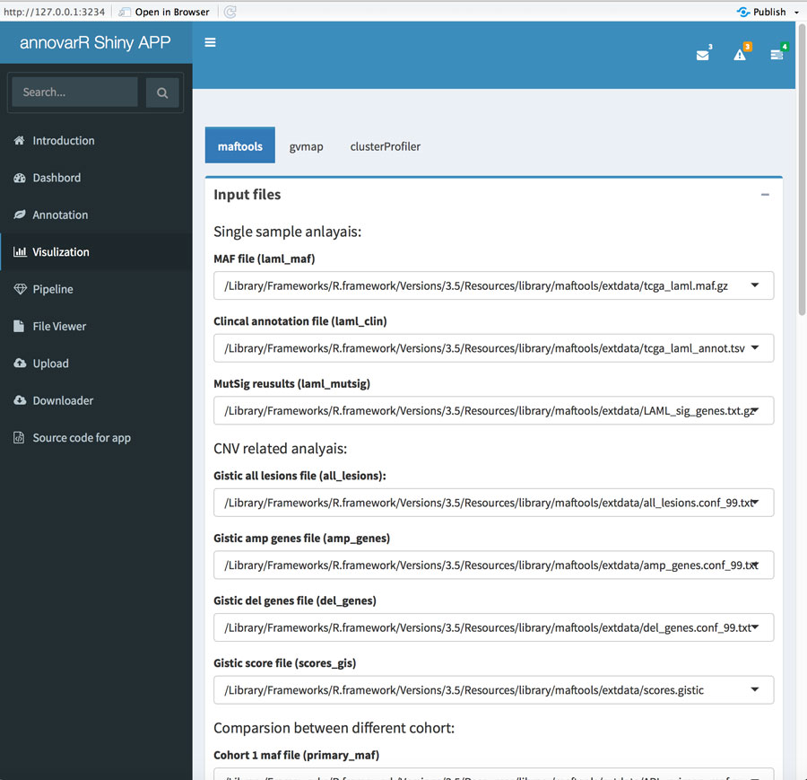

Progress bar indicator will shows in the right-bottom of page, and other warning or error message were also print in the page region.

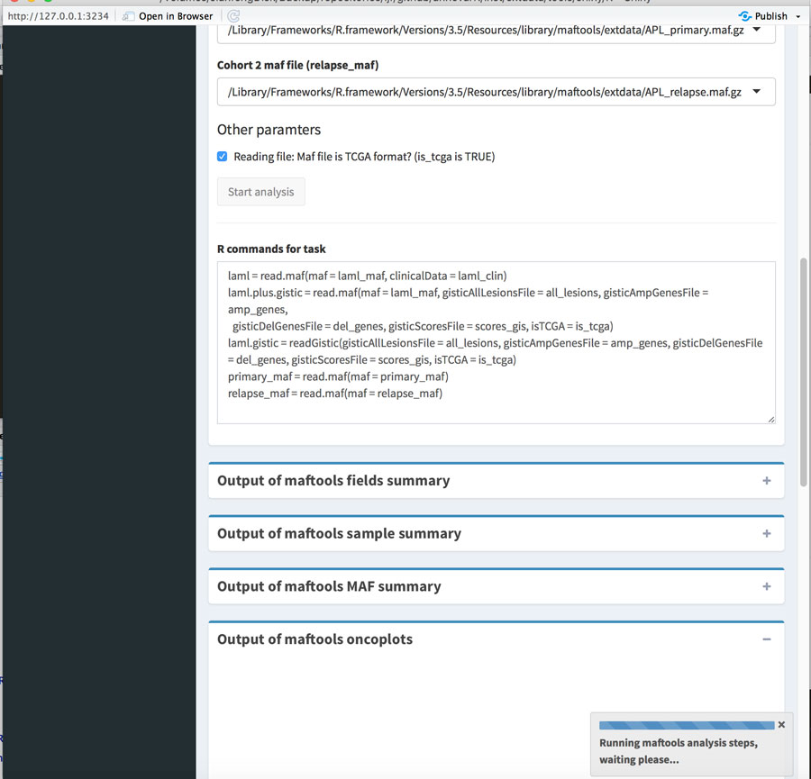

The followed figure is the demo output of function oncoprint of [maftools](https://github.com/PoisonAlien/maftools), a bioconductor package for visulization of MAF format files. 

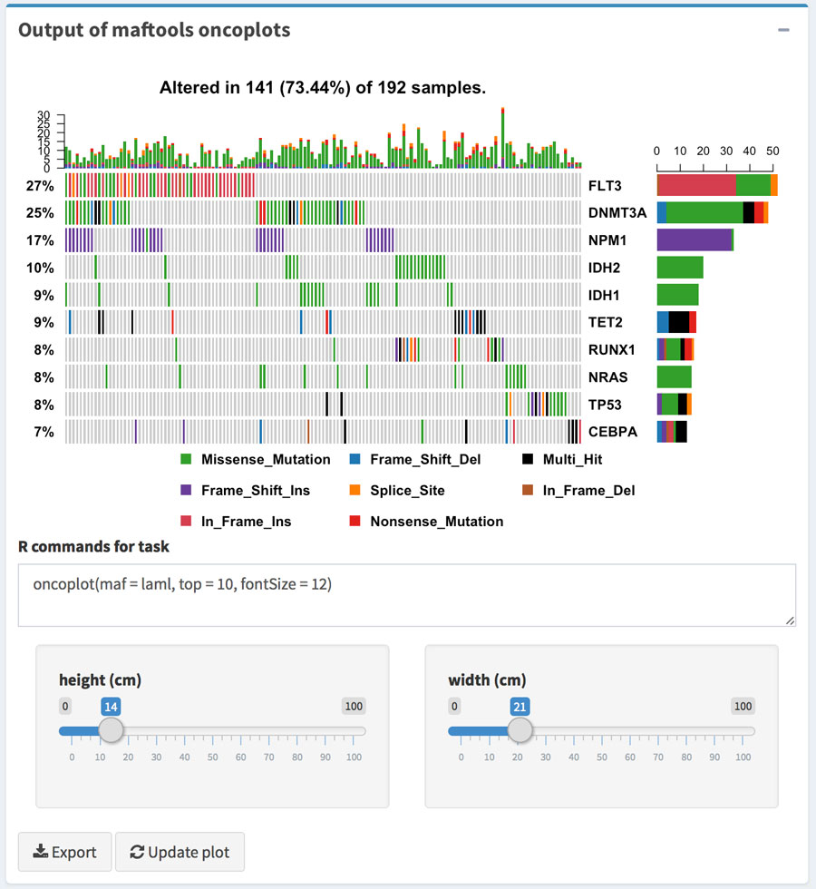

### Pipeline page

We provides the `pipeline page` for another purpose bioinformatics analysis. [CEMiTool](http://www.bioconductor.org/packages/CEMiTool/), a gene co-expression analysis bioconductor package, was used to as the example of this page. It will generate the `html` and `pdf` format reports, and you can download these files using the post key in the dashbord or opencput REST API.

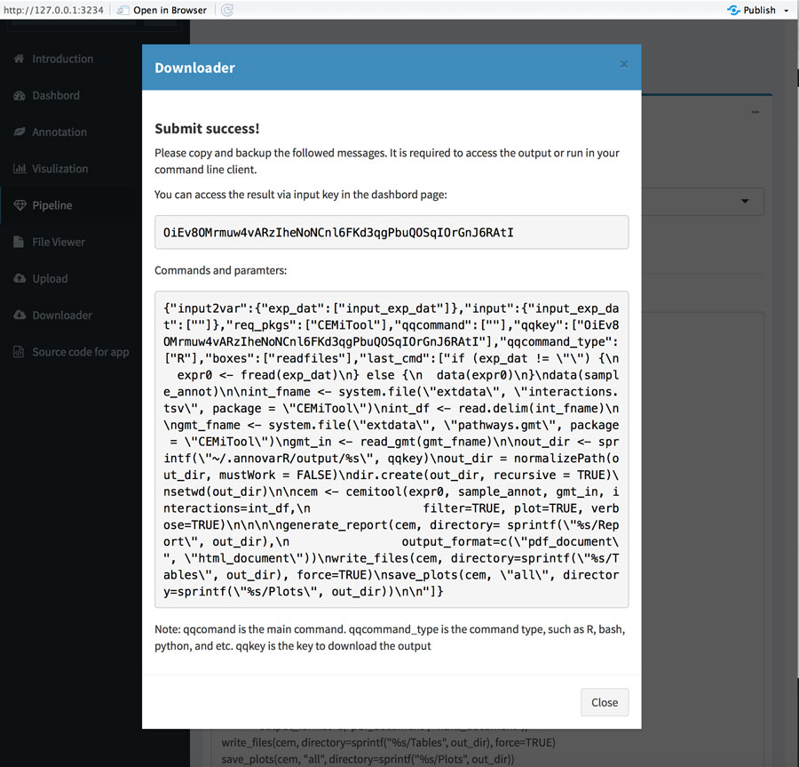

### File Viewer page

`File Viewer page` is a integrated view page for uploaded files. Now, only the text format files were supported to render the content by `DT` package. Besides, you can also to download and delete related files via click respectively rows `trush` button.

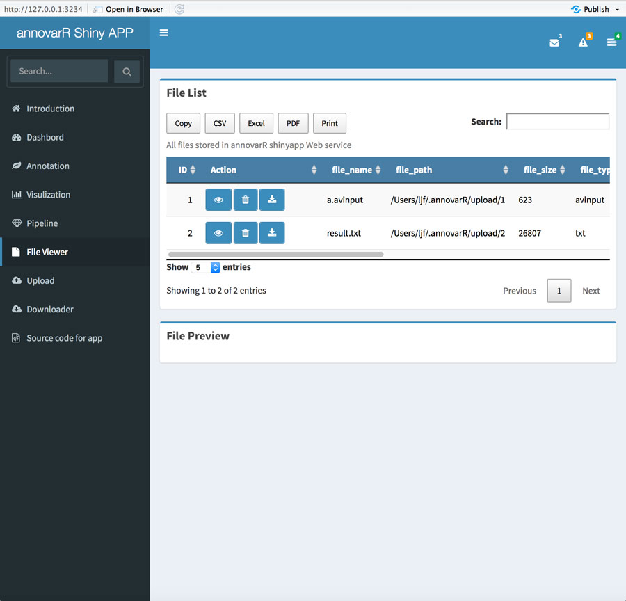

Rendered table content:

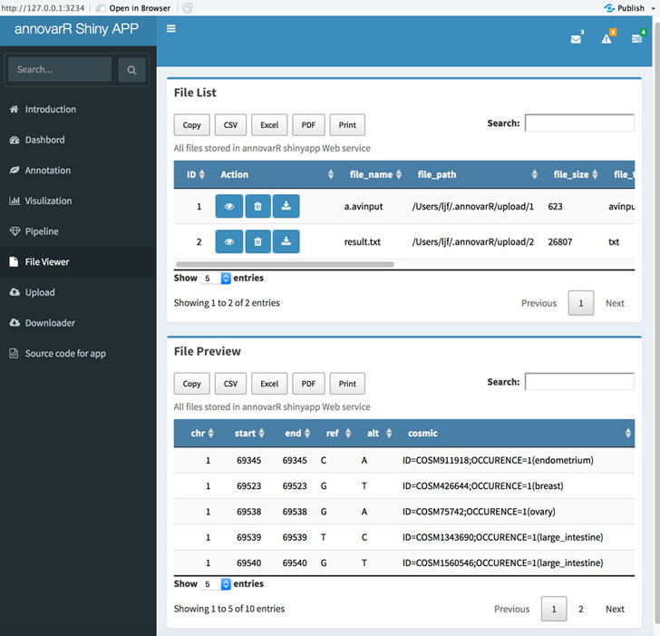

Need confirmed delete action:

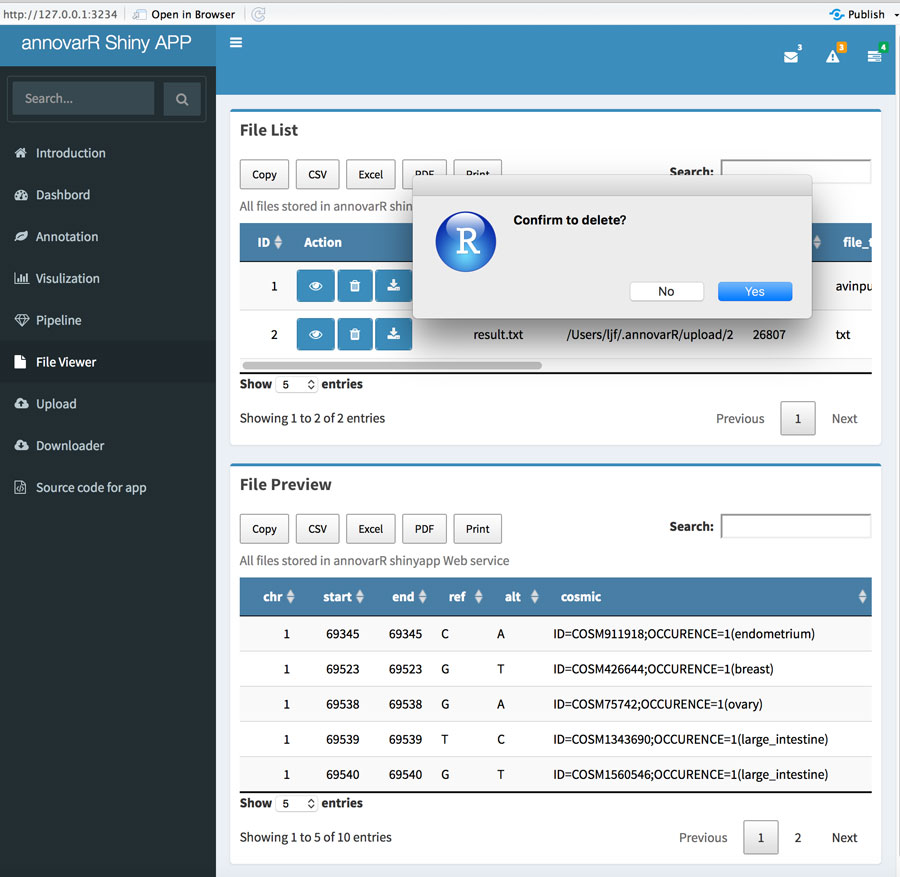

### Upload page

`Upload page` provided the upload function that will be used as the input for annotation and visulization tools.

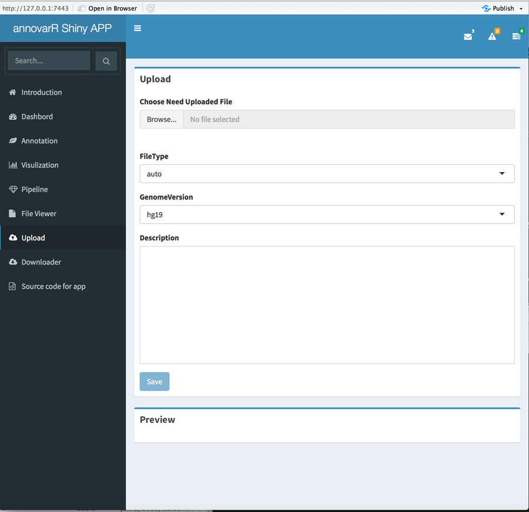

### Downloader page

This page mainly to provide the functions for download of annotation database. We will support more download functions in the future, such as raw sequencing data or other gene expression data. It also will submit a task to worker pool, and you can get the post key to see the related log of download process.

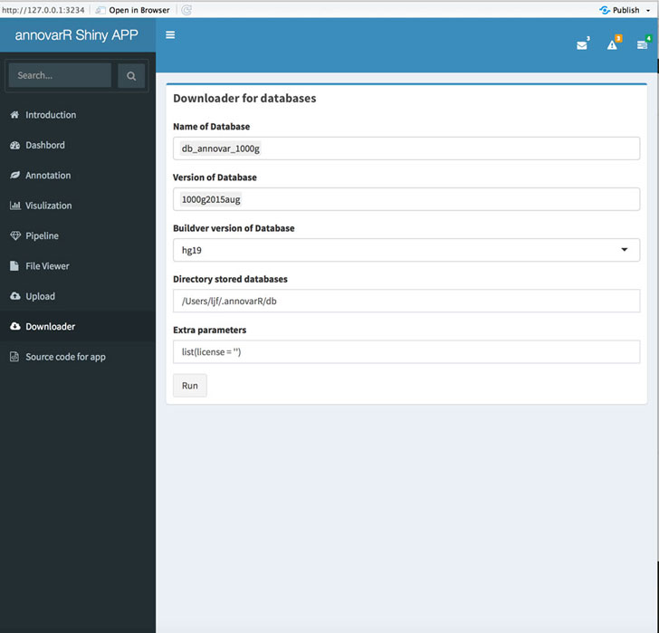
